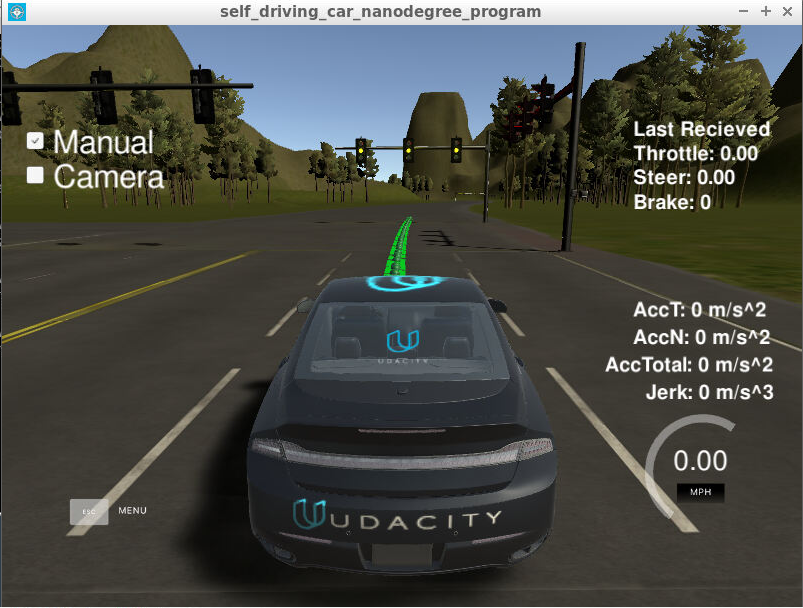

# CarND-System-Integration / Capstone final project : Programming a Real Self-Driving Car (using ROS for system integration)
Self-Driving Car Engineer Nanodegree Program

---

Note : 
- For Udacity evaluation, the write-up report is in [WRITE-UP.md](WRITE-UP.md).

- Setup Video on Youtube : https://youtu.be/dlzWU6_vpxA

- Video of current implementation on Youtube (11+ mins) : https://youtu.be/Wc5q0s_A7mc

## Project Introduction

This project requires to write ROS nodes to implement core functionality of the autonomous vehicle system, including traffic light detection, control, and waypoint following. This project code can be tested using a simulator that mimics the functionality on Carla (Udacity self-driving car).

- Traffic light classification is an optional, stand out suggestion for the project. This is at least suggested to make an attempt at a working traffic light classifier, but it is not required for passing the project. If not doing so, light information can be pulled directly from the simulator to perform stop and go actions at intersections, if desired.



## Project Setup

The project requires the use of Ubuntu Linux (the operating system of Carla) and a new simulator. To reduce installation difficulties, Udacity students can use the provided an in-browser Workspace to work with. If not using Udacity Workspace, follow the steps below to get set up:

- Because ROS is used, you will need to use Ubuntu to develop and test your project code. You may use
  - Ubuntu 14.04 with ROS Indigo
  - Ubuntu 16.04 with ROS Kinetic
  - You are welcome to use your own Ubuntu installation or virtual machine (unsupported), or you can use the VM provided in Your Virtual Machine in the "Introduction to ROS" lesson. The provided VM has ROS and Dataspeed DBW installed already.

- Windows 10 users - your fellow students have suggested that the best local option is to use the VM for ROS, while running the simulator natively (and making sure to open ports between the two for communication).

- The system integration project uses its own simulator which will interface with your ROS code and has traffic light detection. You can download the simulator [here](https://github.com/udacity/CarND-Capstone/releases). To improve performance while using a VM, we recommend downloading the simulator for your host operating system and using this outside of the VM. You will be able to run project code within the VM while running the simulator natively in the host using port forwarding on port 4567. For more information on how to set up port forwarding, see the end of the classroom concept [here](https://s3-us-west-1.amazonaws.com/udacity-selfdrivingcar/files/Port+Forwarding.pdf).

Note that the latest version of the simulator has two test tracks:
- A highway test track with traffic lights
- A testing lot test track

To use the second test lot, you will need to update your code to specify a new set of waypoints. We'll discuss how to do this in a later lesson. Additionally, the first track has a toggle button for camera data. Many students have experienced latency when running the simulator together with a virtual machine, and leaving the camera data off as you develop the car's controllers will help with this issue.

Finally, the simulator displays vehicle velocity in units of mph. However, all values used within the project code are use the metric system (m or m/s), including current velocity data coming from the simulator.

## Project repo instructions

Below are the project repo instructions for those who want to execute this project on their own computers (I ran mine on Udacity provided workspace).

This is the project repo for the final project of the Udacity Self-Driving Car Nanodegree: Programming a Real Self-Driving Car. For more information about the project, see the project introduction [here](https://classroom.udacity.com/nanodegrees/nd013/parts/6047fe34-d93c-4f50-8336-b70ef10cb4b2/modules/e1a23b06-329a-4684-a717-ad476f0d8dff/lessons/462c933d-9f24-42d3-8bdc-a08a5fc866e4/concepts/5ab4b122-83e6-436d-850f-9f4d26627fd9).

Please use **one** of the two installation options, either native **or** docker installation.

### Native Installation

* Be sure that your workstation is running Ubuntu 16.04 Xenial Xerus or Ubuntu 14.04 Trusty Tahir. [Ubuntu downloads can be found here](https://www.ubuntu.com/download/desktop).
* If using a Virtual Machine to install Ubuntu, use the following configuration as minimum:
  * 2 CPU
  * 2 GB system memory
  * 25 GB of free hard drive space

  The Udacity provided virtual machine has ROS and Dataspeed DBW already installed, so you can skip the next two steps if you are using this.

* Follow these instructions to install ROS
  * [ROS Kinetic](http://wiki.ros.org/kinetic/Installation/Ubuntu) if you have Ubuntu 16.04.
  * [ROS Indigo](http://wiki.ros.org/indigo/Installation/Ubuntu) if you have Ubuntu 14.04.
* [Dataspeed DBW](https://bitbucket.org/DataspeedInc/dbw_mkz_ros)
  * Use this option to install the SDK on a workstation that already has ROS installed: [One Line SDK Install (binary)](https://bitbucket.org/DataspeedInc/dbw_mkz_ros/src/81e63fcc335d7b64139d7482017d6a97b405e250/ROS_SETUP.md?fileviewer=file-view-default)
* Download the [Udacity Simulator](https://github.com/udacity/CarND-Capstone/releases).

### Docker Installation
[Install Docker](https://docs.docker.com/engine/installation/)

Build the docker container
```bash
docker build . -t capstone
```

Run the docker file
```bash
docker run -p 4567:4567 -v $PWD:/capstone -v /tmp/log:/root/.ros/ --rm -it capstone
```

### Port Forwarding
To set up port forwarding, please refer to the [instructions from term 2](https://classroom.udacity.com/nanodegrees/nd013/parts/40f38239-66b6-46ec-ae68-03afd8a601c8/modules/0949fca6-b379-42af-a919-ee50aa304e6a/lessons/f758c44c-5e40-4e01-93b5-1a82aa4e044f/concepts/16cf4a78-4fc7-49e1-8621-3450ca938b77)

### Usage

1. Clone the project repository
```bash
git clone https://github.com/udacity/CarND-Capstone.git
```

2. Install python dependencies
```bash
cd CarND-Capstone
pip install -r requirements.txt
```
3. Make and run styx
```bash
cd ros
catkin_make
source devel/setup.sh
roslaunch launch/styx.launch
```
4. Run the simulator

### Real world testing
1. Download [training bag](https://s3-us-west-1.amazonaws.com/udacity-selfdrivingcar/traffic_light_bag_file.zip) that was recorded on the Udacity self-driving car.
2. Unzip the file
```bash
unzip traffic_light_bag_file.zip
```
3. Play the bag file
```bash
rosbag play -l traffic_light_bag_file/traffic_light_training.bag
```
4. Launch your project in site mode
```bash
cd CarND-Capstone/ros
roslaunch launch/site.launch
```
5. Confirm that traffic light detection works on real life images
